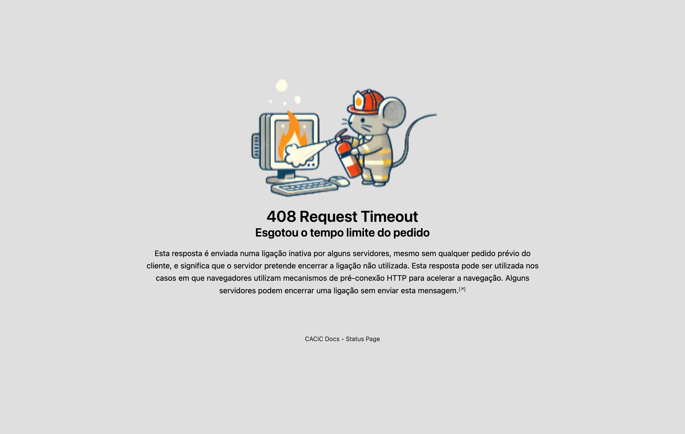

# Error pages

Páginas de erro para uso no proxy reverso dos servidores do CACiC.

A página apresenta [uma descrição do erro](https://developer.mozilla.org/en-US/docs/Web/HTTP/Status) em português e links para a página de documentação e para a página de estado dos serviços do CACiC.

